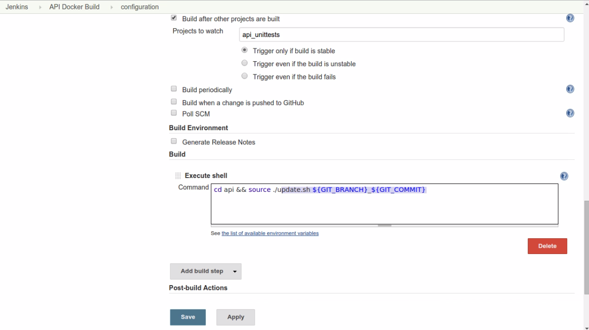

# dockercon2015
This repository contains sample code of my presentation "Continuous Integration with Jenkins, Docker and Compose" presented at DockerCon Europe 2015 (see http://sandrocirulli.net/dockercon2015).

If you are interested in this code, you may want to watch the following videos where I explain the Continuous Integration workflow I used:

[DockerCon Europe 2015 presentation](https://www.youtube.com/watch?v=cvmiM0_3NhA)

[Demo part 1](https://www.youtube.com/watch?v=ppCzDDpcqRk)

[Demo part 2](https://www.youtube.com/watch?v=Vt4MMO89Fkk)

Note that the code in this repository is just sample code to illustrate the videos and the slides. It won't work if you try to run it as there are lots of missing files. The sample code comes from my employer's private repositories and I cannot make them public. 

## Scripts
[manage-leap-components.sh](https://github.com/cirulls/dockercon2015/blob/master/manage-leap-components.sh) is an interactive shell script mainly written by my colleague [Meritxell](https://github.com/gonzalem). It allows to start/stop/build Docker containers and images without much knowledge of Docker or Docker Compose. When you run this script, it presents you with options in order to run Docker and Compose commands for you. This script is also invoked by the api/update.sh. The IP addresses in the script are obviously fake.

The sed instructions in [manage-leap-components.sh](https://github.com/cirulls/dockercon2015/blob/master/manage-leap-components.sh) are used to replace the empty environment variables with the value specific the environment (dev, stage, live) in [docker-compose-aws.yml](https://github.com/cirulls/dockercon2015/blob/master/docker-compose-aws.yml). In this way it is possible to have a single script for dev, stage, and live environments. A major improvement would be to use [variable substitution](https://github.com/docker/compose/releases/tag/1.5.0) (now supported in Docker Compose, it was not available at the time).

## Jenkins container
The Jenkins image is based on the platform_base image. This is a customized version of the official CentOS image with the addition of common libraries shared across other Docker images.

Note that at the time I used Docker Compose 1.2 inside the Jenkins container, I recommend to use a more modern version. Similarly, the version of Jenkins that was installed at the time was 1.619.

[update.sh](https://github.com/cirulls/dockercon2015/blob/master/api/update.sh) is the script executed by the Jenkins job. It invokes the script manage-leap-components.sh which is essentially a wrapper around Docker and Docker Compose commands. This is a screenshot of the Jenkins job configuration to build the API image, stop the API container, and start the new API container based on the latest Docker image. 

## API container
The API container is a Python Flask application running an API. [update.sh](https://github.com/cirulls/dockercon2015/blob/master/api/update.sh) is probably the file you may want to inspect as it is used by the Jenkins job. 

## Feedback
Note that I have not committed all the files referenced in the Dockerfiles. If there are other files you may find useful to inspect, feel free to contact me or raise an issue in the [issue tracker](https://github.com/cirulls/dockercon2015/issues). 

Let me know if you find these files useful. All the code in this repository is under licensed under [GPL v3](LICENSE). 

